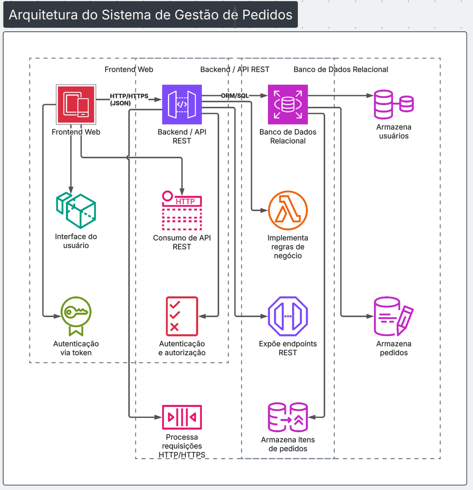

# 📦 Sistema de Gestão de Pedidos

## 👥 Integrantes do Grupo

| RM        | Nome                     |
|-----------|--------------------------|
| RM362208  | Adriano Rabello          |
| RM365052  | Francielli Manchini Tateo|
| RM364993  | Fábio Ivo Silva          |
| RM365124  | Renato Magri Trevine     |
| RM362550  | Rafael Gava Yokoyama     |

---

## 📌 Visão Geral

Este projeto descreve a **arquitetura de um Sistema de Gestão de Pedidos**, cujo objetivo é servir como base para implementação em aulas práticas de engenharia de software.  

O sistema permite o cadastro, acompanhamento e gerenciamento de pedidos, aplicando boas práticas de separação de camadas, organização de responsabilidades e comunicação via API REST, favorecendo a manutenibilidade, escalabilidade e evolução da solução.

---

## 🎯 Funcionalidades Principais

- Autenticação de usuários  
- Cadastro e gerenciamento de usuários  
- Criação de pedidos  
- Atualização do status dos pedidos  
- Consulta de pedidos (por usuário ou geral)  
- Visualização de histórico de pedidos  
- Geração de relatórios simples  

---

## 👥 Tipos de Usuários e Permissões

### 🔑 Administrador
- Gerenciar usuários  
- Visualizar todos os pedidos  
- Alterar o status de qualquer pedido  
- Acessar relatórios  

### 👤 Usuário
- Criar pedidos  
- Consultar seus próprios pedidos  
- Atualizar pedidos enquanto estiverem em status inicial  

### 👀 Usuário de Leitura
- Visualizar pedidos  
- Não possui permissão de criação ou edição  

---

## 🧩 Entidades Principais e Relacionamentos

O modelo de domínio do sistema é composto pelas seguintes entidades:

- **Usuário**  
- **Perfil**  
- **Pedido**  
- **ItemPedido**  

Relacionamentos principais:
- Um Usuário pode possuir um ou mais Perfis  
- Um Usuário pode criar vários Pedidos  
- Um Pedido pode conter vários Itens de Pedido  

---

## 🔌 Endpoints da API (Principais Rotas REST)

- `POST /auth/login` – Autenticação de usuários  
- `GET /users` – Consulta de usuários  
- `POST /users` – Cadastro de usuários  
- `GET /orders` – Consulta de pedidos  
- `POST /orders` – Criação de pedidos  
- `PUT /orders/{id}` – Atualização de pedido  
- `PATCH /orders/{id}/status` – Atualização do status do pedido  

---

## 🛠️ Tecnologias Sugeridas

- **Frontend:** Framework SPA  
- **Backend:** Framework Web REST  
- **Banco de Dados:** Banco de dados relacional  
- **Autenticação:** JWT  
- **Infraestrutura:** Containers  
- **Versionamento:** Git  

---

## 🔄 Fluxos Principais

### Fluxo de Criação de Pedido

1. O usuário acessa o sistema por meio do frontend  
2. O frontend envia a requisição de criação para a API  
3. O backend valida os dados e aplica as regras de negócio  
4. O pedido é persistido no banco de dados  
5. O backend retorna a confirmação da operação ao frontend  

---

## 🏗️ Diagrama de Arquitetura

O diagrama abaixo representa a arquitetura em camadas do sistema, evidenciando a separação entre frontend, backend e banco de dados.

---

## 📌 Considerações Finais

Este projeto foi elaborado com foco em clareza arquitetural, separação de responsabilidades e uso didático, servindo como base sólida para implementação, testes e futuras evoluções do sistema.
