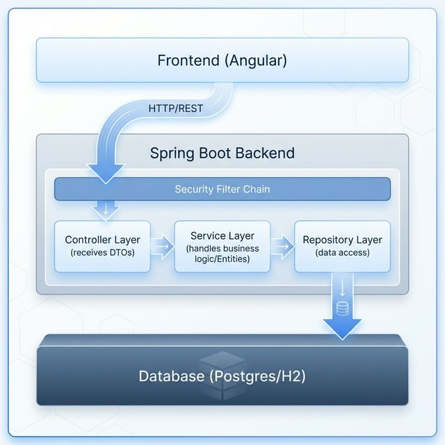
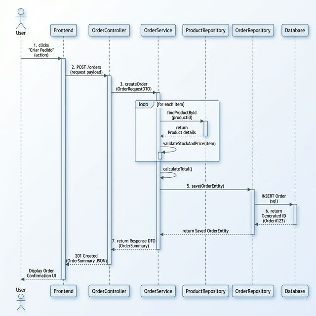
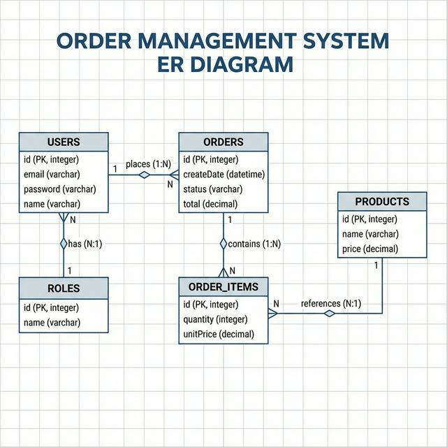

# Documentação Arquitetural

## Diagrama de Componentes e Camadas
O sistema segue uma arquitetura em camadas estrita para garantir a separação de responsabilidades (SoC) e facilitar a manutenibilidade.

## Decisões Arquiteturais

### 1. Separação de Camadas
*   **Controller:** Responsável apenas por receber requisições HTTP, validar dados de entrada (via DTOs) e retornar respostas formatadas. Não contém regras de negócio.
*   **Service:** Contém toda a regra de negócio da aplicação. É onde as transações são gerenciadas.
*   **Repository:** Interface de comunicação com o banco de dados. Utiliza Spring Data JPA para abstrair queries comuns.
*   **Model (Entity):** Representa as tabelas do banco de dados. Mapeamento ORM.

### 2. DTOs (Data Transfer Objects)
Optamos por usar DTOs para comunicação externa da API.
*   **Motivo:** Evitar expor a estrutura interna do banco de dados (Entidades) diretamente.
*   **Segurança:** Previne Mass Assignment Vulnerabilities.
*   **Versionamento:** Permite alterar o banco de dados sem quebrar o contrato da API.

### 3. Padrão REST
A API segue os princípios RESTful:
*   Uso correto dos verbos HTTP (GET, POST, PUT, DELETE, PATCH).
*   Stateless (cada requisição contém toda a informação necessária).
*   Recursos bem definidos (/orders, /users).

### 4. Diagrama de Sequência: Criação de Pedido

## Diagrama de Entidade-Relacionamento (ER)

