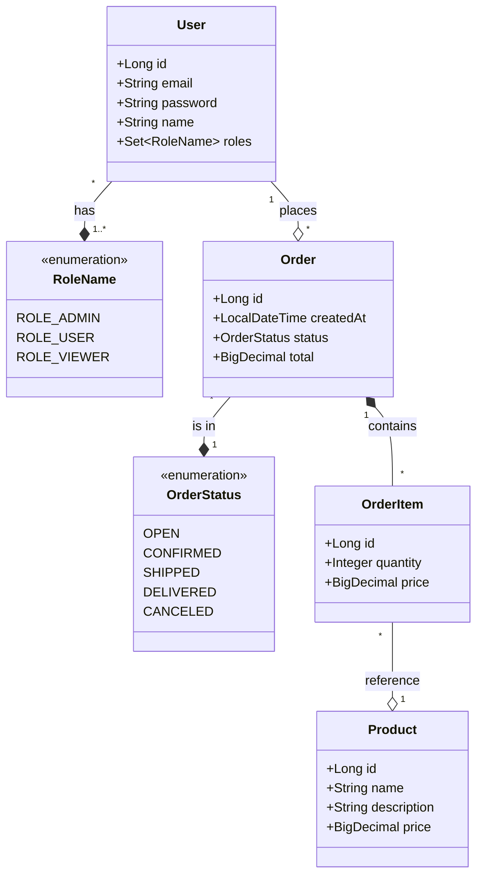

# Domain Documentation

This document describes the core domain model of the Order Management System.

## Class Diagram

## Entity Descriptions

### User
Represents a system user. Users can have multiple roles (ADMIN, USER, VIEWER) which determine their permissions.

### Product
Represents the items available for purchase in the system. Includes name, description, and current price.

### Order
Represents a purchase made by a user. Tracks the creation date, current status, and total amount.

### OrderItem
A specific line item within an order. It records the product, the quantity ordered, and the price at the time of purchase.

### OrderStatus (Enum)
Defines the lifecycle of an order: `OPEN`, `CONFIRMED`, `SHIPPED`, `DELIVERED`, `CANCELED`.

### RoleName (Enum)
Defines the authorization levels: `ROLE_ADMIN`, `ROLE_USER`, `ROLE_VIEWER`.
