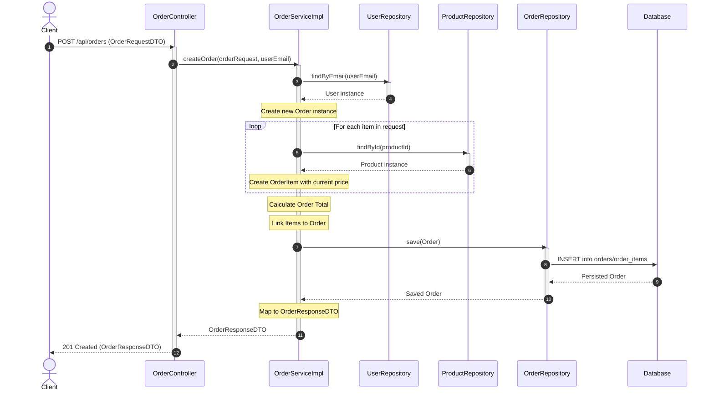

# Sequence Diagram: Order Creation

This diagram illustrates the flow of creating a new order in the system, from the initial API request to the final persistence in the database.

## Step-by-Step Explanation

1.  **Request Initiation**: The client sends a `POST` request to `/api/orders` with the order details.
2.  **Controller Delegation**: The `OrderController` authenticates the request and passes the data to the `OrderServiceImpl`.
3.  **User Verification**: The service retrieves the user information from the `UserRepository` using the email from the security context.
4.  **Order Initialization**: A new `Order` entity is instantiated and associated with the user.
5.  **Product Validation**: For each item in the request, the service validates the existence of the product and snapshots its current price.
6.  **Persistence**: The complete `Order` (including its `OrderItems`) is saved to the database through the `OrderRepository`.
7.  **Response**: The newly created order is mapped to a `DTO` and returned to the client with a `201 Created` status.
